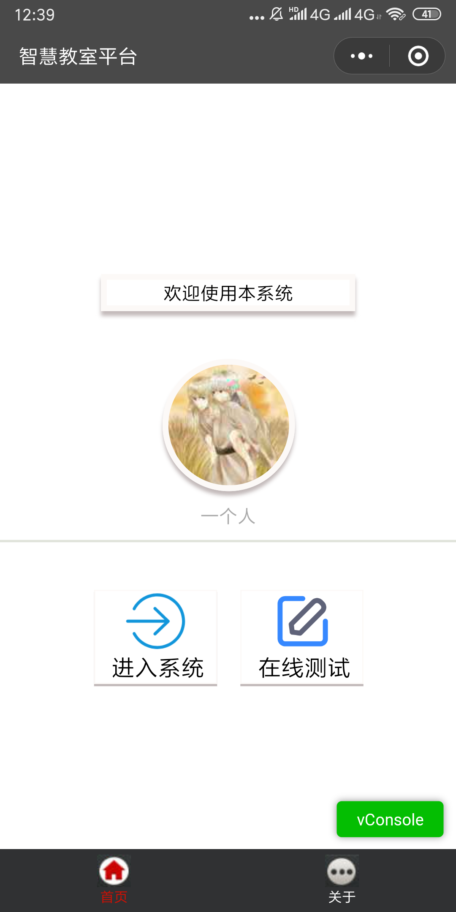
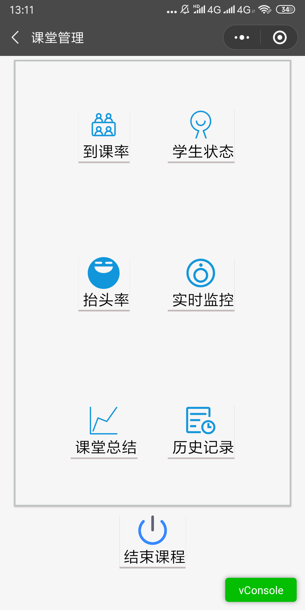
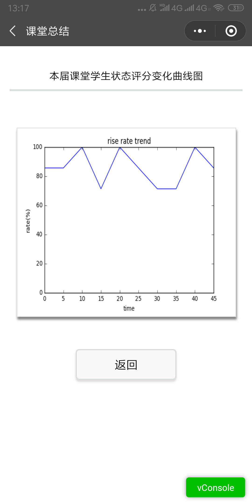
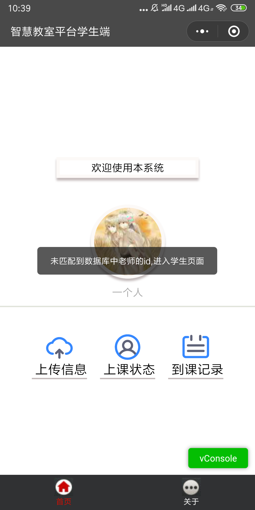

# wx-xdface

微信小程序-xdface

=======

## 项目简介

学生先上传个人图片到服务器并保存个人信息到数据库，在老师点击开始上课后，服务器端通过php脚本调用运行人脸识别python程序，通过摄像头获取课堂实时图片和监控，抓到的全班图片与个人图片进行人脸识别比对并将到课信息对应于每个人存到数据库中，微信小程序通过https请求获取服务器端数据库的数据，教师和学生分别可以看到对应的不同数据信息。小程序根据每个用户的openid绑定其身份并存入小程序云开发的数据库中，即老师通过数据库已有的数据进行识别，而学生则在上传信息后也有在数据库中有了其微信对应绑定的身份信息。

### 主要功能

进行点名，和后端数据交互

## 小程序截图图片预览

## 参考文档

微信小程序官方开发文档

## 存在的问题以及改进

* 消息推送
* 学生和老师身份的识别，老师的微信openid需要开发人员提前存入云开发数据库中。
* 到课情况课堂表现等数据进行消息推送功能的实现
* 界面样式的设计（可以考虑用别人提供的组件样式进行美化）
* 代码的可读性、可维护性很差，以后需要尽量去除冗余代码，并对关键代码做好注释。
* 其他常见实用功能的实现，例如笔记分享、在线考试功等功能。
